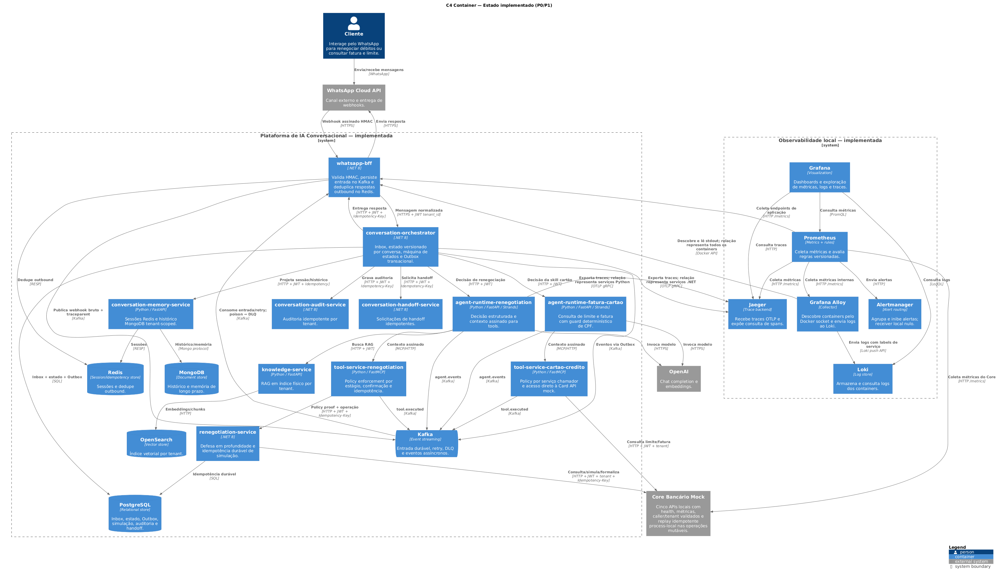

# C4 Container — Implemented State

This view details the services, datastores, queues, and observability components that are executable in the reference environment.

{ loading=lazy }

## Artifacts

- [Open the vector SVG version](C4/c4-container-current.svg)
- PlantUML source: `docs/architecture/C4/c4-container-current.puml`

!!! info "Demonstration data"
    The Banking Core Mock provides synthetic datasets for renegotiation and card scenarios. In production, adapters must use the canonical ports and real APIs defined in P10.
