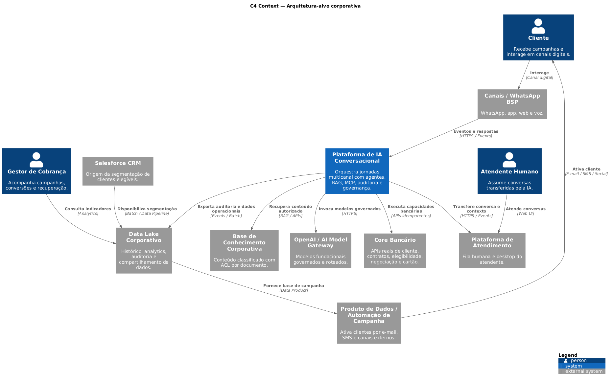

# C4 Context — Arquitetura-alvo

Esta visão representa o ecossistema corporativo esperado para produção, incluindo integrações ainda não implementadas no workspace.

{ loading=lazy }

## Artefatos

- [Abrir versão vetorial SVG](C4/c4-context-target.svg)
- Fonte PlantUML: `docs/architecture/C4/c4-context-target.puml`

!!! warning "Arquitetura-alvo"
    Salesforce, Data Lake, automação de campanha, atendimento humano integrado, Model Gateway, PDP e APIs reais do Core Bancário são capacidades-alvo e não devem ser interpretadas como integrações já disponíveis.
