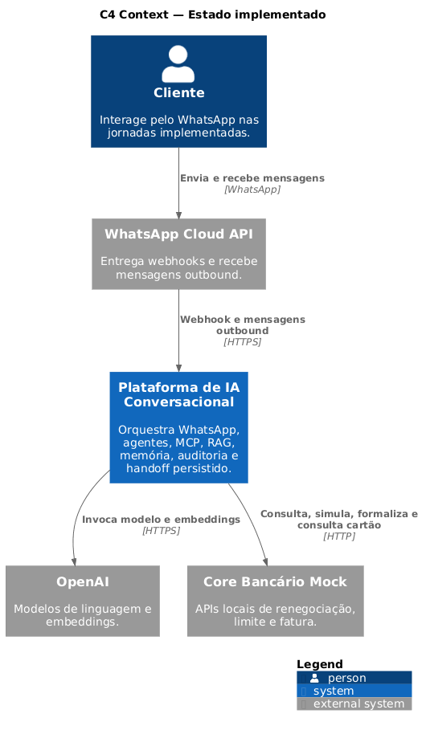
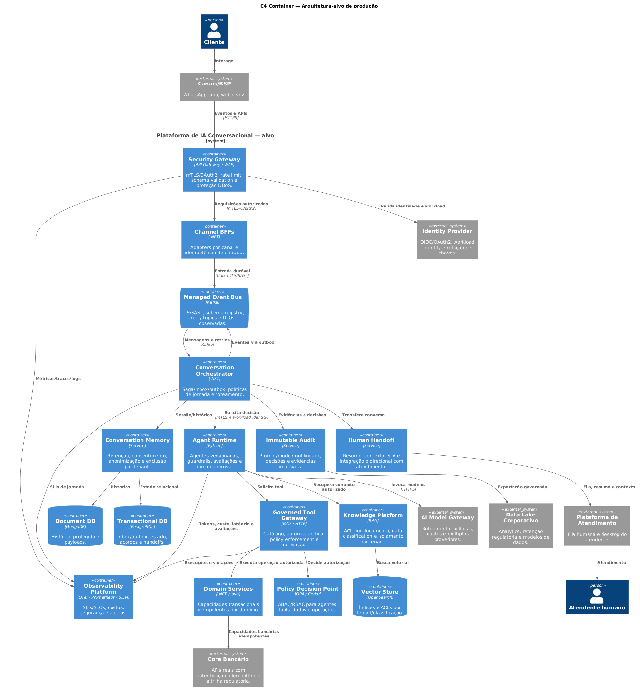

# Modelo C4

## Regra de leitura

A documentação mantém duas visões separadas para impedir que arquitetura planejada seja interpretada como implementação existente:

| Nível | Estado implementado | Arquitetura-alvo |
|---|---|---|
| Contexto | [Abrir visão implementada](c4-context-current.md) | [Abrir visão alvo](c4-context-target.md) |
| Containers | [Abrir containers atuais](c4-container-current.md) | [Abrir containers alvo](c4-container-target.md) |

Os arquivos PlantUML em `docs/architecture/C4/` são as fontes canônicas. Para cada fonte, o CI gera e valida um artefato **SVG** e um **PNG**. O MkDocs exibe os PNGs e mantém o SVG disponível para ampliação.

## Contexto implementado

[{ loading=lazy }](c4-context-current.md)

Representa os sistemas realmente integrados e executáveis no workspace.

## Contexto alvo

[{ loading=lazy }](c4-context-target.md)

Representa o ecossistema esperado para produção, incluindo sistemas corporativos ainda não integrados.

## Containers atuais

[{ loading=lazy }](c4-container-current.md)

Detalha serviços, datastores, filas e observabilidade disponíveis hoje.

## Containers alvo

[{ loading=lazy }](c4-container-target.md)

Detalha capacidades e integrações necessárias para produção corporativa.

## Estado implementado

### Atores e sistemas externos

| Elemento | Papel atual |
|---|---|
| Cliente | Interage pelo WhatsApp nas jornadas de renegociação e consulta de cartão |
| WhatsApp Cloud API | Entrega webhooks e recebe mensagens outbound |
| OpenAI | Fornece modelos de linguagem e embeddings quando o modo mock está desabilitado |
| Core Bancário Mock | Expõe APIs locais de renegociação, limite e fatura usando dados sintéticos |

### Fronteira da plataforma

A Plataforma de IA Conversacional implementada contém:

- Channel BFF para validação do webhook, entrada durável e resposta outbound;
- Conversation Orchestrator com Inbox, estado e Outbox transacional;
- duas skills de agente: renegociação e fatura/limite de cartão;
- Tool Services MCP com autorização e isolamento das operações;
- serviço de domínio de renegociação e Core Bancário Mock;
- Knowledge Service, Conversation Memory, Audit Service e Handoff Service;
- PostgreSQL, MongoDB, Redis, OpenSearch e Kafka;
- Jaeger, Loki, Grafana Alloy, Prometheus e Grafana.

### Limites atuais

- O Handoff Service persiste pedidos de transferência, mas ainda não integra uma plataforma real de atendimento.
- Salesforce, Data Lake e automação de campanha não são chamados pelo código.
- A base de conhecimento é composta por PDFs montados localmente no `knowledge-service`.
- O Core Bancário é um mock e não representa regras financeiras nem controles completos de produção.
- O canal implementado é WhatsApp Cloud API; os demais canais pertencem à visão alvo.

## Arquitetura-alvo corporativa

A visão alvo adiciona capacidades que não devem ser confundidas com o estado atual:

| Capacidade alvo | Situação no workspace |
|---|---|
| Salesforce e segmentação de campanha | Não implementada |
| Data Lake e retenção regulatória | Não implementada |
| Produto de dados / automação de campanha | Não implementada |
| Plataforma de atendimento bidirecional | Não implementada |
| Base corporativa com classificação e ACL | Parcial: PDFs locais por tenant |
| AI Model Gateway com múltiplos provedores | Não implementado; chamada direta à OpenAI |
| APIs reais do Core Bancário e cartões | Não implementadas; P10 define portas e critérios de onboarding |
| Workload identity, mTLS e rotação de chaves | Não implementados |
| PDP central com OPA/Cedar | Não implementado |
| Kafka gerenciado com TLS/SASL e Schema Registry | Não implementado |
| Auditoria imutável e exportação governada | Parcial: PostgreSQL local |

## Critério de atualização

Uma dependência só deve migrar da visão alvo para a visão implementada quando houver pelo menos uma destas evidências:

1. integração confirmada em código;
2. configuração executável no Compose ou infraestrutura equivalente;
3. teste automatizado ou evidência E2E registrada em `docs/validation/`.

Documentos de intenção, ADRs futuros e diagramas conceituais isolados não são evidência de implementação.
