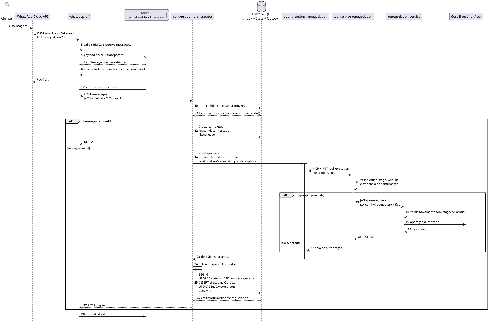
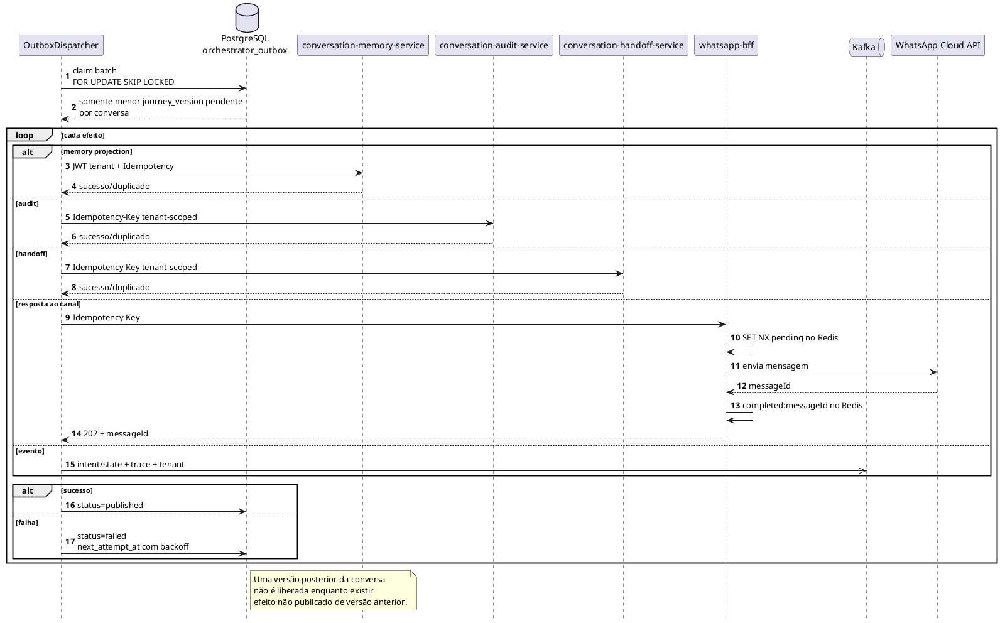
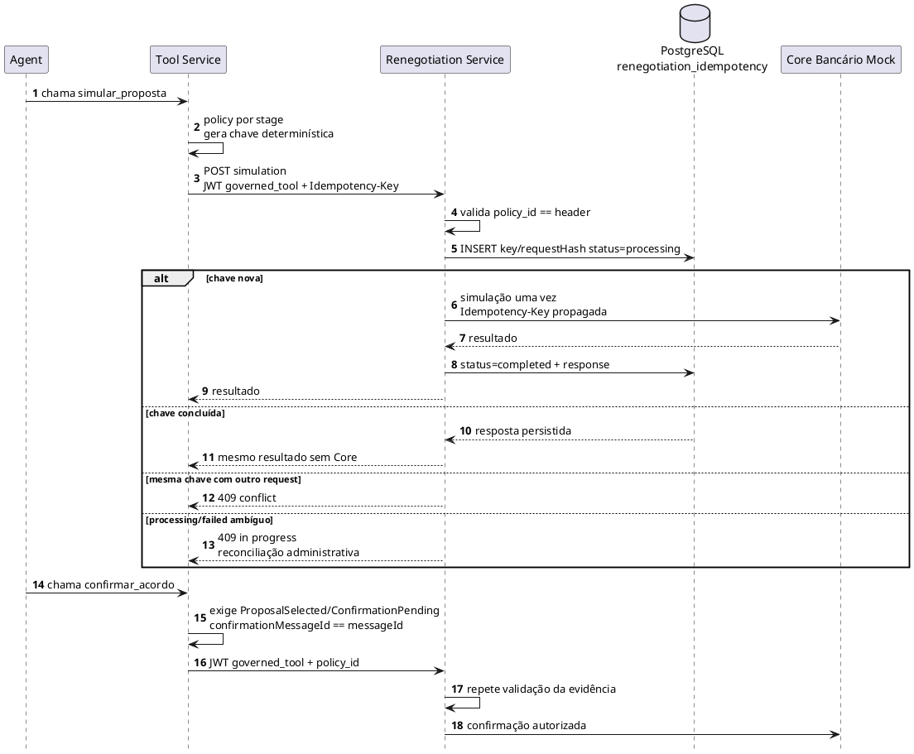
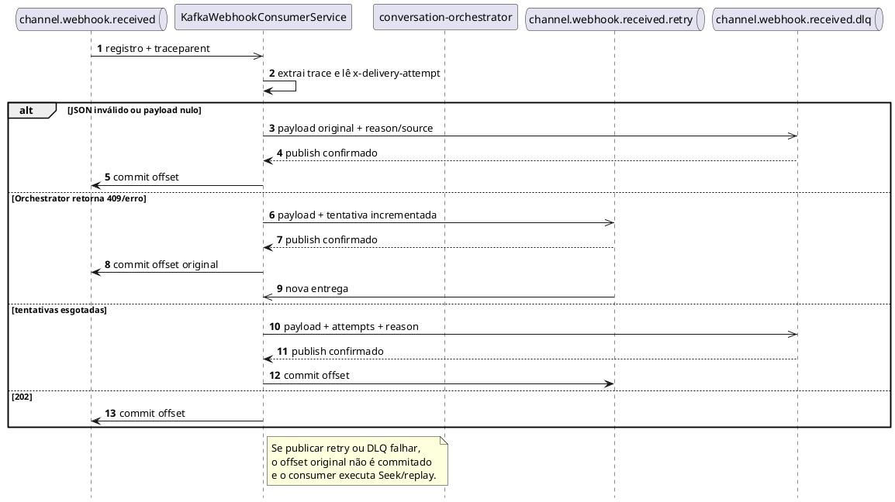
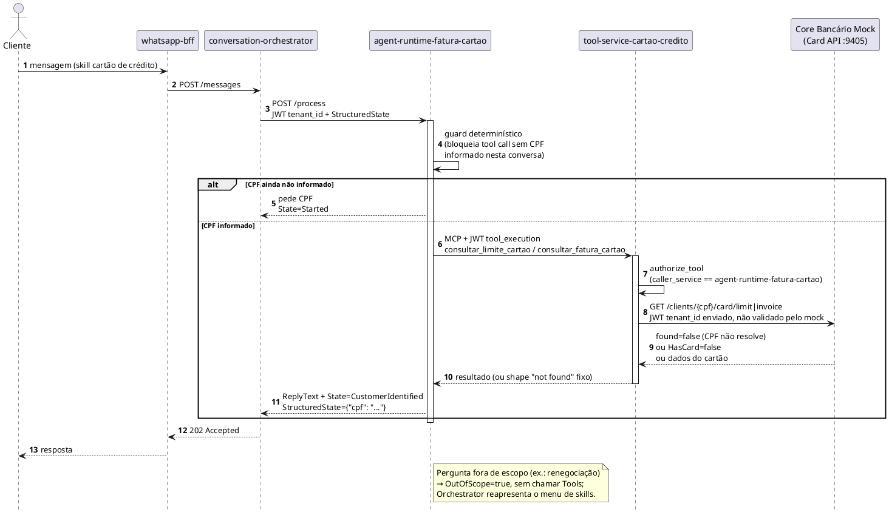

# Diagramas de sequência — estado implementado P0/P1

Os diagramas abaixo descrevem somente o código implementado. A arquitetura-alvo permanece separada em `C4/c4-container-target.puml`.

## 1. Aceite da mensagem e persistência transacional

## 2. Dispatcher da Outbox

## 3. Idempotência de simulação e confirmação

## 4. Retry de entrada e DLQ

## 5. Consulta de fatura/limite de cartão de crédito (segunda skill)

Fluxo somente-leitura, sem simulação/confirmação/idempotência de negócio — deliberadamente mais simples que os diagramas 1 e 3, que descrevem a jornada de renegociação.

Diferenças em relação à jornada de renegociação:

- Sem `tenacity`/retry entre `agent-runtime-fatura-cartao` e `tool-service-cartao-credito` — falha de conexão MCP apenas degrada (agente segue sem a tool).
- Sem serviço de domínio intermediário nem PostgreSQL de idempotência — `tool-service-cartao-credito` chama o Core Bancário Mock diretamente, com retry via `tenacity` (3 tentativas) só nessa borda.
- Autorização por `caller_service`, não por estágio de jornada — não há "stage" nem "evidência de confirmação" nesse domínio, porque não há simulação/confirmação a proteger.
- CPF nunca trafega nos eventos Kafka (`agent.events`/`tool.executed`) publicados por nenhum dos dois serviços.

## 6. Garantias e limites

| Aspecto | Garantia implementada |
|---|---|
| Entrada WhatsApp | ACK somente depois de Kafka confirmar persistência |
| Conclusão do Inbox | Apenas após estado e efeitos serem gravados na mesma transação |
| Side effects | Outbox at-least-once + deduplicação no destino |
| Ordenação | lease por conversa, versão otimista, late-message detection e barrier na Outbox |
| Tenant | UUID canônico presente no header e em claim JWT assinada |
| Tools | allowlist por estágio e policy proof validada no Tool e no serviço de domínio |
| Simulação | resultado persistido por tenant/key/hash; replay sem Core |
| Confirmação | exige evidência assinada ligada à mensagem atual |
| Memória | unicidade `(tenantId, externalMessageId)` |
| Audit/Handoff | unicidade `(tenant_id, idempotency_key)` |

Limites atuais:

- o Core Bancário Mock não está disponível para implementação da validação de JWT e idempotência no último salto;
- por isso, simulações ambíguas falham fechadas e exigem reconciliação administrativa;
- Handoff ainda persiste o pedido, sem transferir para plataforma humana real;
- o HS256 compartilhado continua sendo solução de POC endurecida;
- build, migração em volume existente e E2E precisam ser executados antes do merge.
