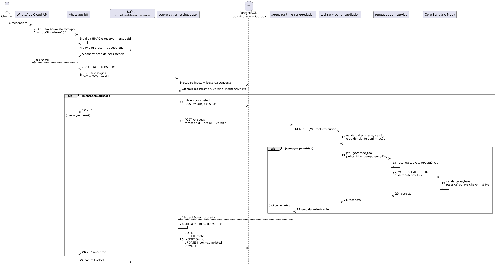
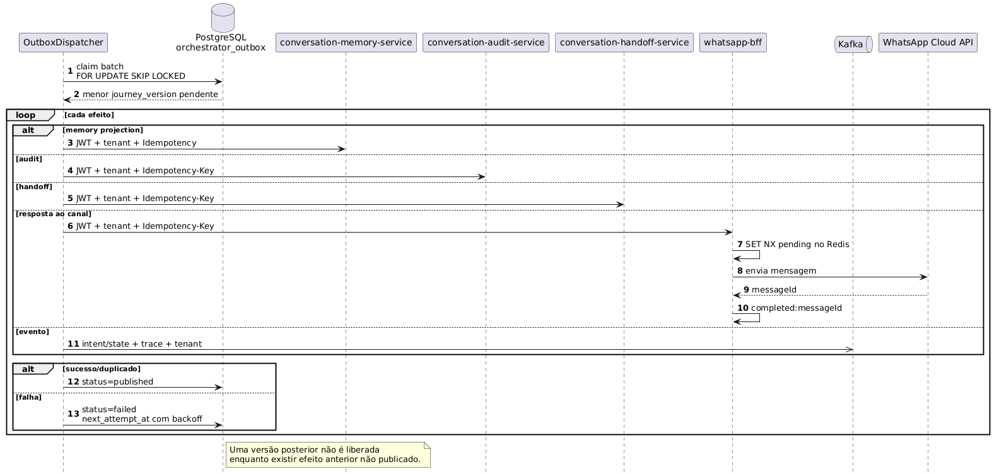
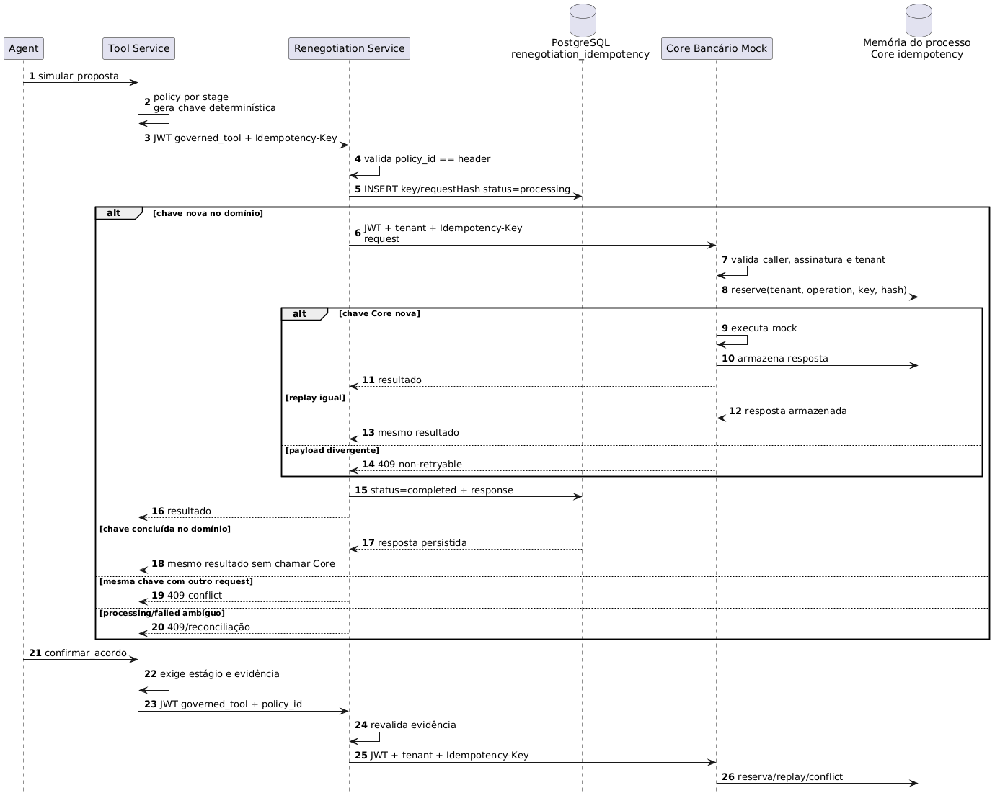
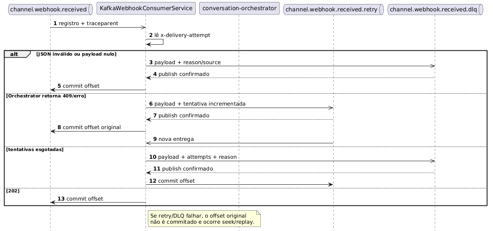
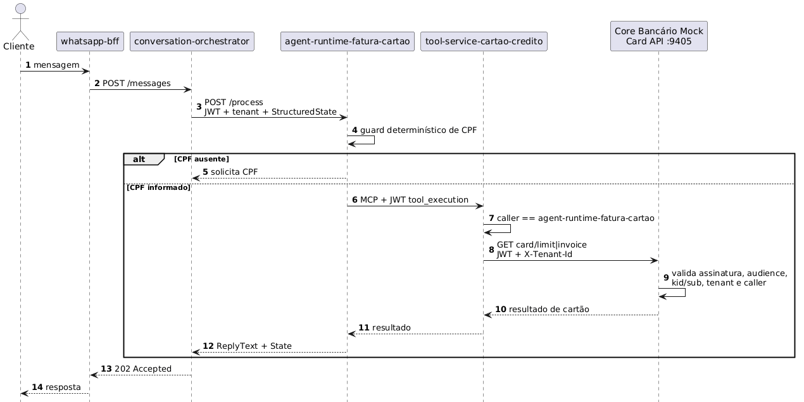

# Diagramas de sequência — estado implementado

Os diagramas descrevem o change set coordenado da plataforma. A arquitetura-alvo permanece em `C4/c4-container-target.puml`.

As fontes PlantUML em `docs/architecture/sequence/` são canônicas. Para cada fonte, o CI gera e valida um artefato **SVG** e um **PNG**. Esta página exibe os PNGs e mantém o SVG disponível para ampliação.

## 1. Aceite da mensagem e operação governada

{ loading=lazy }

### Artefatos

- [Abrir versão vetorial SVG](sequence/message-acceptance-governed-operation.svg)
- Fonte PlantUML: `docs/architecture/sequence/message-acceptance-governed-operation.puml`

## 2. Dispatcher da Outbox

{ loading=lazy }

### Artefatos

- [Abrir versão vetorial SVG](sequence/outbox-dispatcher.svg)
- Fonte PlantUML: `docs/architecture/sequence/outbox-dispatcher.puml`

## 3. Idempotência de simulação e confirmação

{ loading=lazy }

### Artefatos

- [Abrir versão vetorial SVG](sequence/simulation-confirmation-idempotency.svg)
- Fonte PlantUML: `docs/architecture/sequence/simulation-confirmation-idempotency.puml`

A persistência PostgreSQL do domínio é a garantia durável. O store do Core é process-local e adiciona determinismo/defesa em profundidade durante homologação.

## 4. Retry de entrada e DLQ

{ loading=lazy }

### Artefatos

- [Abrir versão vetorial SVG](sequence/input-retry-dlq.svg)
- Fonte PlantUML: `docs/architecture/sequence/input-retry-dlq.puml`

## 5. Consulta de fatura/limite

Fluxo somente leitura, sem idempotência de negócio por desenho.

{ loading=lazy }

### Artefatos

- [Abrir versão vetorial SVG](sequence/card-invoice-limit-query.svg)
- Fonte PlantUML: `docs/architecture/sequence/card-invoice-limit-query.puml`

Diferenças para renegociação:

- sem serviço de domínio intermediário;
- autorização por identidade, não por estágio;
- sem `Idempotency-Key`, pois são consultas;
- CPF não é publicado em `agent.events` ou `tool.executed`.

## 6. Garantias e limites

| Aspecto | Garantia implementada |
|---|---|
| Entrada WhatsApp | ACK após persistência Kafka |
| Inbox | conclusão após estado e efeitos na mesma transação |
| Side effects | Outbox at-least-once + dedupe |
| Ordenação | lease, versão otimista, late-message e barrier |
| Tenant | UUID no header e claim assinada |
| Tools | allowlist/policy no Tool e domínio |
| Core | caller/tenant validados; mutações exigem chave |
| Simulação | PostgreSQL durável + replay process-local no Core |
| Confirmação | evidência assinada e idempotência no último hop |
| Memória | unicidade `(tenantId, externalMessageId)` |
| Audit/Handoff | unicidade `(tenant_id, idempotency_key)` |

Limites:

- idempotência do Core é perdida no restart;
- HS256 continua simétrico;
- Handoff não transfere para plataforma humana;
- receiver Alertmanager é local/nulo;
- E2E multi-repositório precisa ser executado e registrado antes de promoção.
